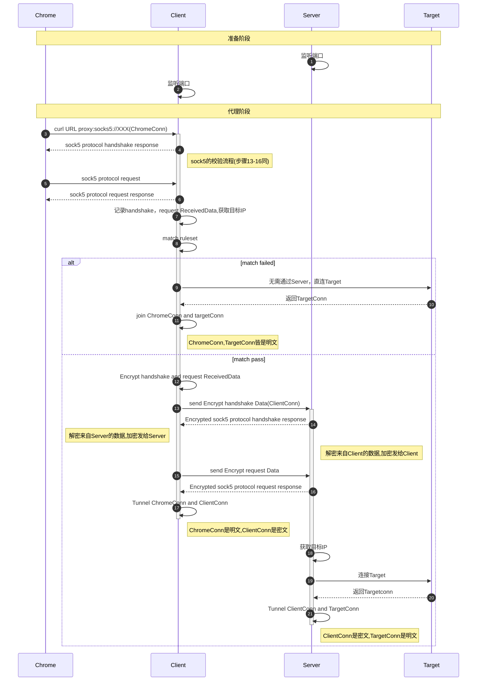
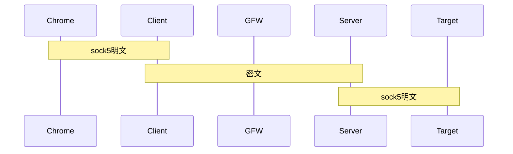

## shadowsocks 玩具

usage:

```go
package main

import (
	"fmt"
	"github.com/juju/errors"
	"github.com/obgnail/shadowsocks-toy/cipher"
	"github.com/obgnail/shadowsocks-toy/client"
	_ "github.com/obgnail/shadowsocks-toy/logger"
	"github.com/obgnail/shadowsocks-toy/ruleset"
	"github.com/obgnail/shadowsocks-toy/server"
	log "github.com/sirupsen/logrus"
	"os/exec"
	"time"
)

const (
	ClientListenAddr = "127.0.0.1:4444"
	ServerListenAddr = "127.0.0.1:5555"
)

func main() {
	cph := cipher.NewByteMapCipher()
	srv, err := server.New(ServerListenAddr, cph)
	if err != nil {
		log.Fatal("new server err", err)
	}
	go startServer(srv)

	go func() {
		time.Sleep(time.Second)
		startChrome()
	}()

	//clt, err := client.New(ClientListenAddr, ServerListenAddr, cph, &ruleset.Direct{})
	clt, err := client.New(ClientListenAddr, ServerListenAddr, cph,  &ruleset.Global{})
	if err != nil {
		log.Fatal("new client err", err)
	}
	startClient(clt)
}

func startChrome() {
	chromeDriver := "/Applications/Google Chrome.app/Contents/MacOS/Google Chrome"
	url := "https://www.baidu.com"

	args := []string{
		"--headless",
		"--disable-gpu",
		"--dump-dom",
		"--proxy-server" + "=" + fmt.Sprintf("socks5://%s", ClientListenAddr),
		url,
	}
	cmd := exec.Command(chromeDriver, args...)
	data, err := cmd.Output()
	if err != nil {
		log.Fatal("err:", err)
	}
	fmt.Println(string(data[:600]), "\n...")
}

func startServer(server *server.Server) {
	if err := server.Listen(nil); err != nil {
		log.Error(errors.ErrorStack(err))
	}
}

func startClient(client *client.Client) {
	if err := client.Listen(nil); err != nil {
		log.Error(errors.ErrorStack(err))
	}
}
```

## sequenceDiagram



## Conn



